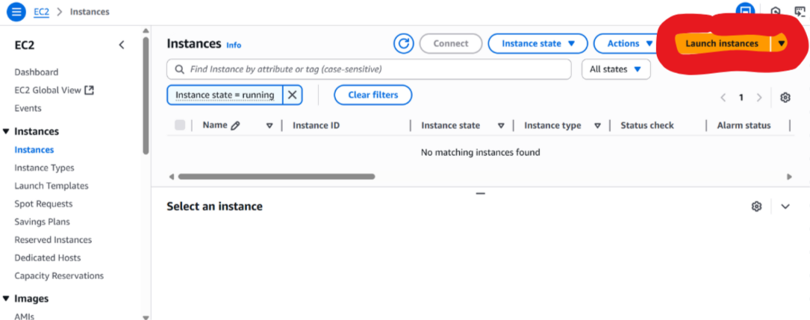
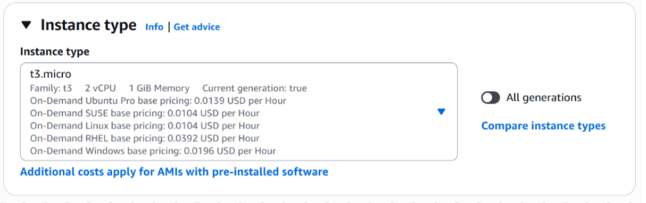
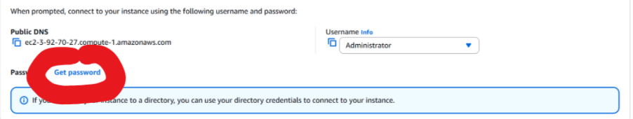
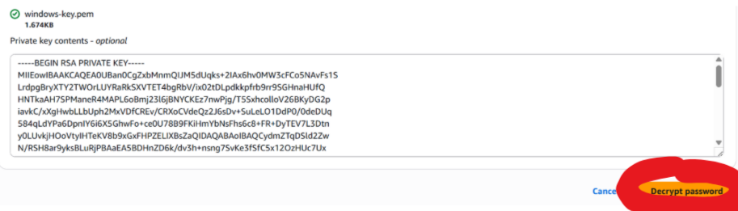
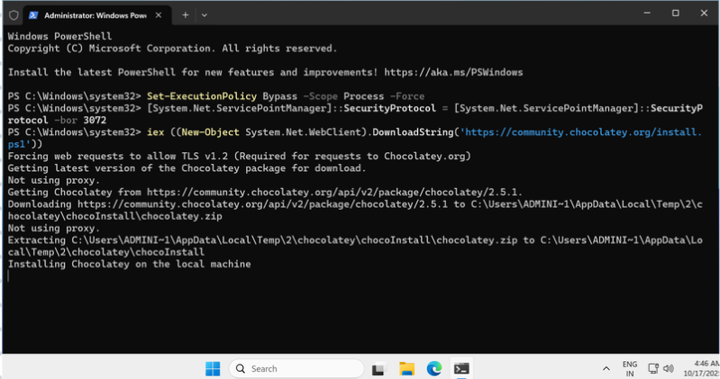
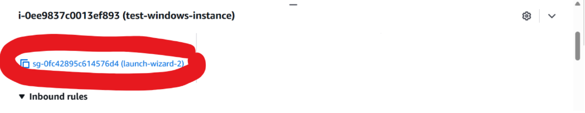

# AWS Lab: Deploying a Flask Application on Windows EC2

### Objective
Creating a Windows EC2 instance, connecting to it using RDP, and creating a (very) simple Flask web application.

## Step 1: Launch an EC2 Instance

1. Log in to the AWS Management Console and open the EC2 Dashboard.
  
   


2. Click "Launch Instance" and configure as follows:

   <br><br><br>
   <br><br><br>
   <br><br><br>
   <br><br><br>
   <br><br><br>
   <br><br><br>
   

---

## Step 2: Retrieve the Windows Administrator Password

Follow the steps mentioned below and upload your .pem file to receive your administrator password.

<br><br><br>
<br><br><br>
<br><br><br>
<br><br><br>
<br><br><br>


---

## Step 3: Connect with RDP 

1) Copy the IP address of the EC2 instance. 


   
2) Enter that as the Computer name in Remote Desktop Connection. 

<br><br><br>


3) Login with the password that has been retrieved in the previous step: 

<br><br><br>


---

## Step 3: Create the application

1) Open powershell in the windows instance and run the following command to install Chocolatey

```bash
Set-ExecutionPolicy Bypass -Scope Process -Force
[System.Net.ServicePointManager]::SecurityProtocol = [System.Net.ServicePointManager]::SecurityProtocol -bor 3072
iex ((New-Object System.Net.WebClient).DownloadString('https://community.chocolatey.org/install.ps1'))
```
<br><br><br>


2) Type the following code in a notepad file (inside the project folder) named app.py

```bash
mkdir flask_app
```

```bash
cd flask_app
```

```bash
notepad app.py
```

```bash
from flask import Flask

app = Flask(__name__)

@app.route("/")
def hello():
    return "Hello from EC2!"

if __name__ == "__main__":
    app.run(host="0.0.0.0", port=5000)
```

3) Run the application

```bash
python app.py
```


---

## Step 4: Edit the inbound rules of the security group and access the app

<br><br><br>
<br><br><br>
<br><br><br>
<br>

Open the application in your browser by running the URL below:

```bash
http://<replace-with-your-public-ip>:5000
```