# AWS Lab: Spinning up an RDS Database

### Objective
Creating an RDS Database, and running a few basic SQL queries in it.

## Step 1: Creating an RDS Database

1. Log in to the AWS Management Console and open "Aurora and RDS".
  
   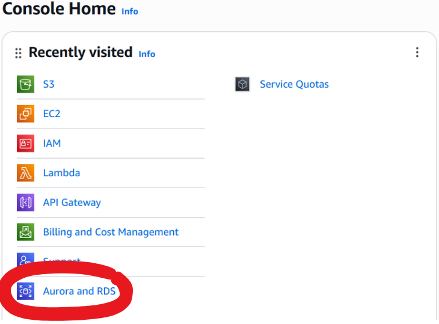

2. Click "Create Database" and configure as follows:

   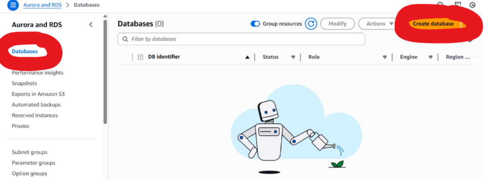<br><br><br>
   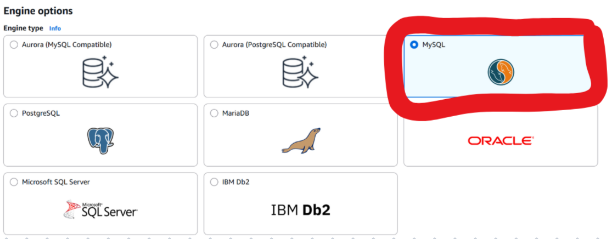<br><br><br>
   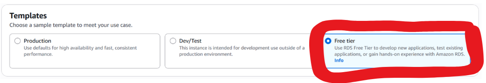<br><br><br>
   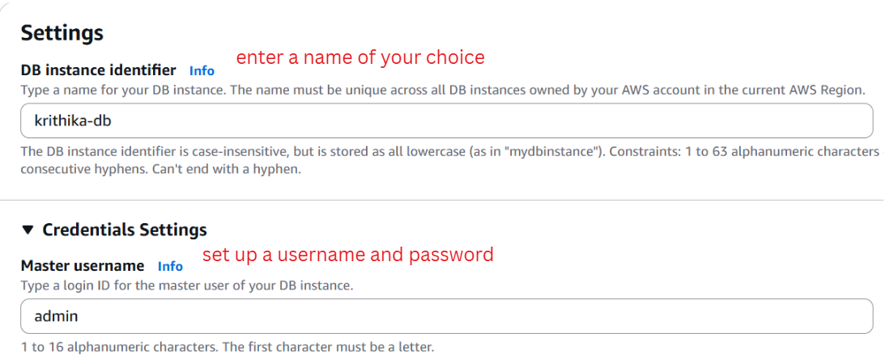<br><br><br>
   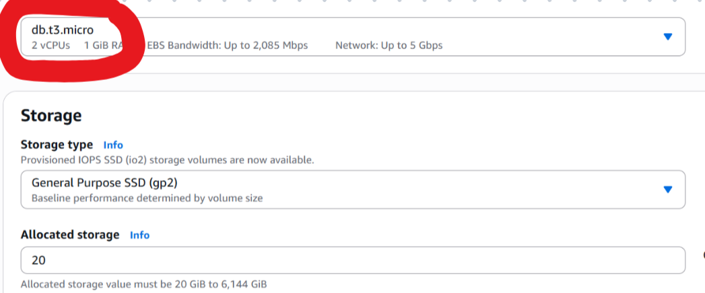<br><br><br>
   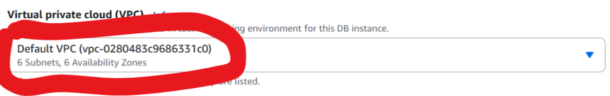<br><br><br>
   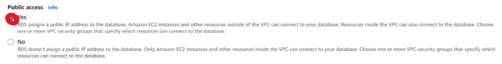<br><br><br>
   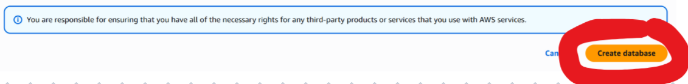

---

## Step 2: Modifying the Security group to allow a Connection

Edit the inbound rules of the default security group as shown below: 
  
   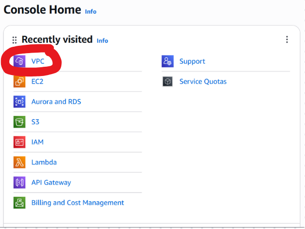<br><br><br>
   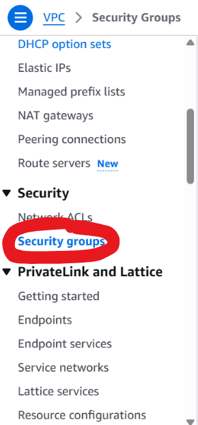<br><br><br>
   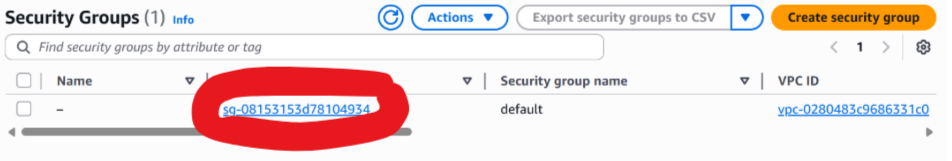<br><br><br>
   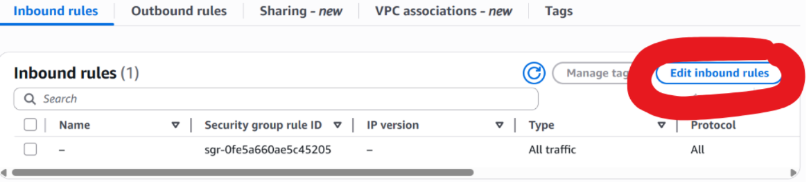<br><br><br>
   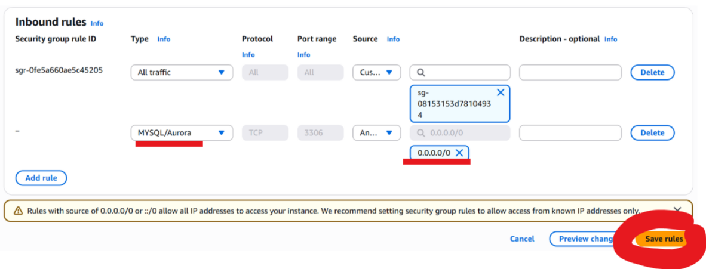
  
---

## Step 3: Connecting to the database locally 

Get the endpoint URL 
   
   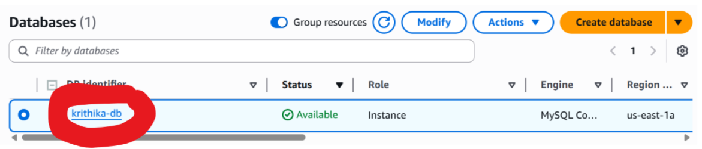<br><br><br>
   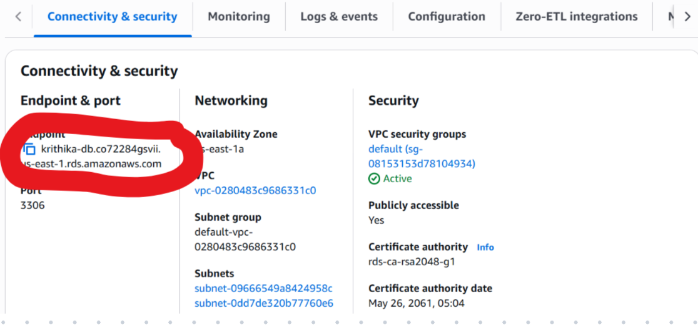

2. Run this command in your terminal, replacing with your own URL. 
   
```bash
mysql -h your-endpoint.rds.amazonaws.com -P 3306 -u admin -p
```
 
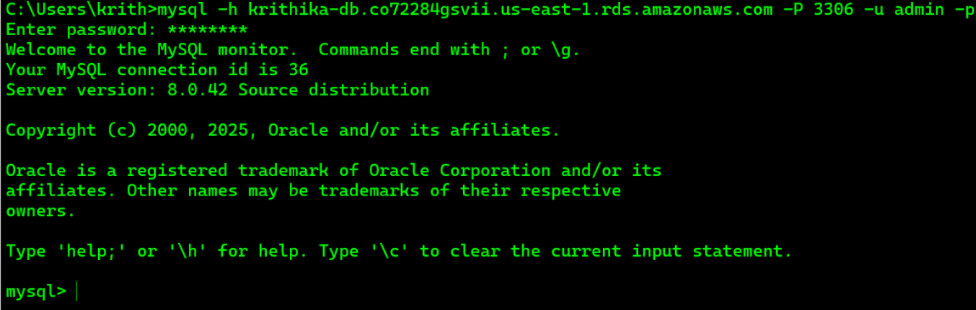


3. You can try out different kinds of SQL queries. An example has been given below: 

```bash
CREATE DATABASE company;
```

```bash
USE company;
```

```bash
CREATE TABLE employees (
    id INT AUTO_INCREMENT PRIMARY KEY,
    name VARCHAR(50),
    role VARCHAR(50),
    salary DECIMAL(10,2)
);
```

```bash
INSERT INTO employees (name, role, salary) VALUES
('Krithika Sai', 'Developer', 75000.00),
('Aditi Balaji', 'Designer', 75000.00),
('Bharath Kumar', 'Manager', 80000.00);
```

```bash
SELECT * FROM employees;
```

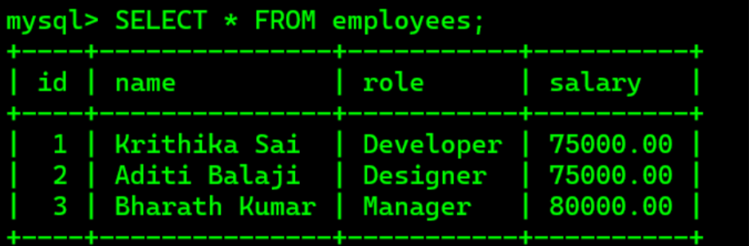

   
---

## Step 4:(Optional) Connecting to the RDS from MySQL app to view the created tables

Create a new connection, use the endpoint URL as the hostname, and enter the username and password that you had created. 

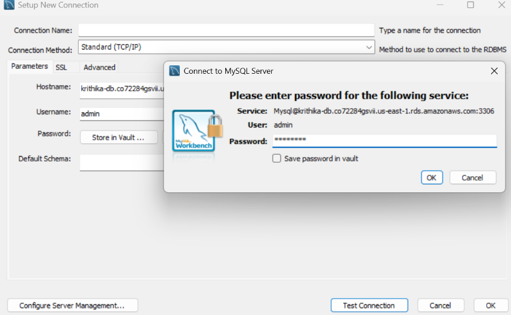<br><br><br> 
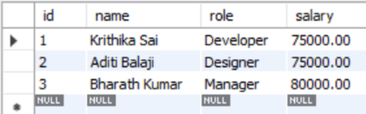
 
