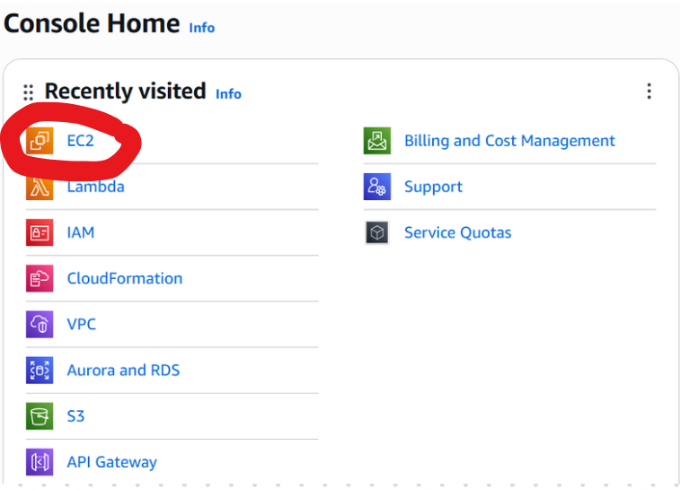
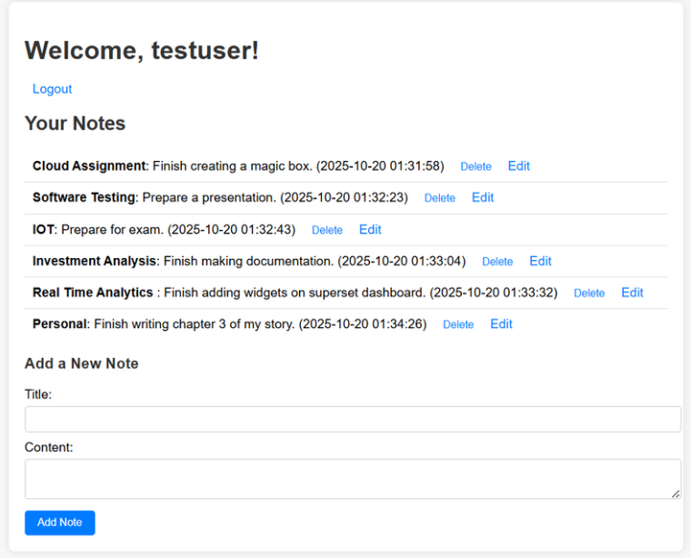

# AWS Mini Project: Creating a simple Flask Notes Application, using Ubuntu EC2 instance and RDS backend

### Objective
Creating a notes app in which users can register and log in, and use it to create, read, update and delete notes. 

## Step 1: Launch an EC2 Ubuntu Instance

1. Log in to the AWS Management Console and open the EC2 Dashboard.
  
   


2. Click "Launch Instance" and configure as shown below:

    

3. Edit the inbound rules in the security group to allow users to access the application we will create.

   

---

## Step 2: Spinning up a database

1. Open from the console, "Aurora and RDS".

   

2. Configure the database as shown in the steps below: 

   

3. Edit the inbound rules in the security group to allow a connection. 

   

   
---

## Step 3: Connecting to the instance and installing the important dependencies

1) Connect to the EC2 instance from your terminal:

```bash
ssh -i your-key.pem ubuntu@<EC2_PUBLIC_IP>
```


2) Run this entire series of commands one by one to install dependencies:

```bash
sudo apt update
```

```bash
sudo apt install python3-pip python3-dev build-essential mysql-client -y
```

```bash
sudo apt install python3-venv -y
```

```bash
mkdir flask-notes
```

```bash
cd flask-notes
```

```
python3 -m venv venv
```

```bash
source venv/bin/activate
```

```bash
pip install flask flask-login pymysql werkzeug
```

---

## Step 3: Connecting to the database from the instance and creating a user

1. Copy the endpoint URL: 


2. Run the below command (inside your EC2 instance terminal) replacing with your own endpoint.

```bash
mysql <endpoint-url> -u admin -p
```

3. Run the following MySQL Queries (to create a database with tables, and inserting a user for logging into the application)

```bash
CREATE DATABASE notes_app;

USE notes_app;

CREATE TABLE users (
    id INT AUTO_INCREMENT PRIMARY KEY,
    username VARCHAR(50) UNIQUE NOT NULL,
    password_hash VARCHAR(255) NOT NULL
);

CREATE TABLE notes (
    id INT AUTO_INCREMENT PRIMARY KEY,
    user_id INT NOT NULL,
    title VARCHAR(100),
    content TEXT,
    created_at TIMESTAMP DEFAULT CURRENT_TIMESTAMP,
    FOREIGN KEY (user_id) REFERENCES users(id)
);

INSERT INTO users (username, password_hash)
VALUES ('testuser', 'testpass');
```

---

## Step 4: Creating the application

Create code files as per the structure given below:


```bash
nano app.py
```
app.py code: 

```bash
import pymysql
pymysql.install_as_MySQLdb()

from flask import Flask, render_template, request, redirect, url_for, session, flash
from flask_login import LoginManager, UserMixin, login_user, login_required, logout_user, current_user
import MySQLdb
from werkzeug.security import generate_password_hash, check_password_hash

app = Flask(__name__)
app.secret_key = "super-secret-key"  

# Flask-Login setup
login_manager = LoginManager()
login_manager.login_view = 'login'
login_manager.init_app(app)

# RDS MySQL config
DB_CONFIG = {
    "host": "replace with your endpoint",
    "user": "replace with your username",
    "passwd": "replace with your password",
    "db": "notes_app"
}

# User class
class User(UserMixin):
    def __init__(self, id, username):
        self.id = id
        self.username = username

@login_manager.user_loader
def load_user(user_id):
    conn = MySQLdb.connect(**DB_CONFIG)
    cursor = conn.cursor()
    cursor.execute("SELECT id, username FROM users WHERE id = %s", (user_id,))
    result = cursor.fetchone()
    cursor.close()
    conn.close()
    if result:
        return User(result[0], result[1])
    return None

# Helper function to connect to DB
def get_db():
    return MySQLdb.connect(**DB_CONFIG)

# Routes
@app.route('/')
@login_required
def home():
    conn = get_db()
    cursor = conn.cursor()
    cursor.execute("SELECT id, title, content, created_at FROM notes WHERE user_id = %s", (current_user.id,))
    notes = cursor.fetchall()
    cursor.close()
    conn.close()
    return render_template('notes.html', notes=notes, username=current_user.username)

@app.route('/add_note', methods=['POST'])
@login_required
def add_note():
    title = request.form['title']
    content = request.form['content']
    conn = get_db()
    cursor = conn.cursor()
    cursor.execute("INSERT INTO notes (user_id, title, content) VALUES (%s, %s, %s)",
                   (current_user.id, title, content))
    conn.commit()
    cursor.close()
    conn.close()
    return redirect(url_for('home'))

@app.route('/edit_note/<int:note_id>', methods=['GET', 'POST'])
@login_required
def edit_note(note_id):
    conn = get_db()
    cursor = conn.cursor()
    if request.method == 'POST':
        title = request.form['title']
        content = request.form['content']
        cursor.execute("UPDATE notes SET title=%s, content=%s WHERE id=%s AND user_id=%s",
                       (title, content, note_id, current_user.id))
        conn.commit()
        cursor.close()
        conn.close()
        return redirect(url_for('home'))
    else:
        cursor.execute("SELECT title, content FROM notes WHERE id=%s AND user_id=%s", (note_id, current_user.id))
        note = cursor.fetchone()
        cursor.close()
        conn.close()
        if note:
            return render_template('edit_note.html', note_id=note_id, title=note[0], content=note[1])
        else:
            return redirect(url_for('home'))

@app.route('/delete_note/<int:note_id>', methods=['POST'])
@login_required
def delete_note(note_id):
    conn = get_db()
    cursor = conn.cursor()
    cursor.execute("DELETE FROM notes WHERE id=%s AND user_id=%s", (note_id, current_user.id))
    conn.commit()
    cursor.close()
    conn.close()
    return redirect(url_for('home'))

@app.route('/login', methods=['GET', 'POST'])
def login():
    if request.method == 'POST':
        username = request.form['username']
        password = request.form['password']
        conn = get_db()
        cursor = conn.cursor()
        cursor.execute("SELECT id, password_hash FROM users WHERE username=%s", (username,))
        result = cursor.fetchone()
        cursor.close()
        conn.close()
        if result and check_password_hash(result[1], password):
            user = User(result[0], username)
            login_user(user)
            return redirect(url_for('home'))
        else:
            flash("Invalid credentials")
    return render_template('login.html')

@app.route('/register', methods=['GET', 'POST'])
def register():
    if request.method == 'POST':
        username = request.form['username']
        password = request.form['password']
        hashed_pw = generate_password_hash(password)
        conn = get_db()
        cursor = conn.cursor()
        cursor.execute("SELECT id FROM users WHERE username=%s", (username,))
        if cursor.fetchone():
            flash("Username already exists")
        else:
            cursor.execute("INSERT INTO users (username, password_hash) VALUES (%s, %s)", (username, hashed_pw))
            conn.commit()
            flash("User registered! Please log in.")
        cursor.close()
        conn.close()
        return redirect(url_for('login'))
    return render_template('register.html')

@app.route('/logout')
@login_required
def logout():
    logout_user()
    return redirect(url_for('login'))

if __name__ == '__main__':
    app.run(host='0.0.0.0', port=5000, debug=True)
```

Create a folder called templates inside "flask-notes" for storing the HTML files.

```bash
mkdir templates 
```

```bash
cd templates
```


login.html code: 
```
<!DOCTYPE html>
<html>
<head>
    <title>Login</title>
    <link rel="stylesheet" type="text/css" href="{{ url_for('static', filename='css/style.css') }}">
</head>
<body>
<div class="container">
    <h1>Login</h1>
    <form method="post">
        Username: <input name="username"><br>
        Password: <input name="password" type="password"><br>
        <input type="submit" value="Login">
    </form>
    <a href="{{ url_for('register') }}">Register</a>
    
        
            <ul>
            
                <li>{{ msg }}</li>
            
            </ul>
        
    
</div>
</body>
</html>
```


register.html code: 
```bash
<!DOCTYPE html>
<html>
<head>
    <title>Register</title>
    <link rel="stylesheet" type="text/css" href="{{ url_for('static', filename='css/style.css') }}">
</head>
<body>
<div class="container">
    <h1>Register</h1>
    <form method="post">
        Username: <input name="username"><br>
        Password: <input name="password" type="password"><br>
        <input type="submit" value="Register">
    </form>
    <a href="{{ url_for('login') }}">Login</a>
    
        
            <ul>
            
                <li>{{ msg }}</li>
            
            </ul>
        
    
</div>
</body>
</html>
```


notes.html code: 
```bash
<!DOCTYPE html>
<html>
<head>
    <title>My Notes</title>
    <link rel="stylesheet" type="text/css" href="{{ url_for('static', filename='css/style.css') }}">
</head>
<body>
<div class="container">
    <h1>Welcome, {{ username }}!</h1>
    <a href="{{ url_for('logout') }}">Logout</a>

    <h2>Your Notes</h2>
    <ul>
        
            <li>
                <strong>{{ note[1] }}</strong>: {{ note[2] }} ({{ note[3] }})
                <form method="post" action="{{ url_for('delete_note', note_id=note[0]) }}" style="display:inline;">
                    <button type="submit">Delete</button>
                </form>
                <a href="{{ url_for('edit_note', note_id=note[0]) }}">Edit</a>
            </li>
        
            <li>No notes yet.</li>
        
    </ul>

    <h3>Add a New Note</h3>
    <form method="post" action="{{ url_for('add_note') }}">
        Title: <input type="text" name="title"><br>
        Content: <textarea name="content"></textarea><br>
        <input type="submit" value="Add Note">
    </form>
</div>
</body>
</html>
```


edit_note.html code:
```bash
<!DOCTYPE html>
<html>
<head>
    <title>Edit Note</title>
    <link rel="stylesheet" type="text/css" href="{{ url_for('static', filename='css/style.css') }}">
</head>
<body>
<div class="container">
    <h1>Edit Note</h1>
    <form method="post">
        Title: <input type="text" name="title" value="{{ title }}"><br>
        Content: <textarea name="content">{{ content }}</textarea><br>
        <input type="submit" value="Save">
    </form>
    <a href="{{ url_for('home') }}">Back</a>
</div>
</body>
</html>
```

Navigate out of templates with "..cd", and create another directory called "static" to save the CSS files.

```bash
mkdir static
```

```bash
cd static
```

```bash
mkdir css
```


style.css code: 

```bash
body {
    font-family: Arial, sans-serif;
    background-color: #f7f7f7;
    margin: 0;
    padding: 0;
}

.container {
    width: 90%;
    max-width: 800px;
    margin: 40px auto;
    padding: 20px;
    background-color: #fff;
    box-shadow: 0px 0px 10px rgba(0,0,0,0.1);
    border-radius: 8px;
}

h1, h2, h3 {
    color: #333;
}

ul {
    list-style-type: none;
    padding: 0;
}

li {
    padding: 10px;
    border-bottom: 1px solid #ddd;
}

li:last-child {
    border-bottom: none;
}

a, button {
    text-decoration: none;
    color: #007BFF;
    border: none;
    background: none;
    cursor: pointer;
    margin-left: 10px;
}

button:hover, a:hover {
    text-decoration: underline;
}

input[type="text"], textarea {
    width: 100%;
    padding: 8px;
    margin: 5px 0 10px 0;
    border: 1px solid #ccc;
    border-radius: 4px;
}

input[type="submit"] {
    background-color: #007BFF;
    color: white;
    padding: 8px 16px;
    border: none;
    border-radius: 4px;
    cursor: pointer;
}

input[type="submit"]:hover {
    background-color: #0056b3;
}
```
---

## Step 5: Accessing the application: 

1. Run the app

```bash
python app.py
```


2. Paste the below URL in the browser, replacing your IP Address: 

```bash 
http://<your-public-ip-address>:5000/
```

3. Give the username and password that has been inserted in the users database. 


4. Try out different CRUD operations, like adding, deleting, or updating tasks. 



5. The tasks can also be viewed in the database. 


