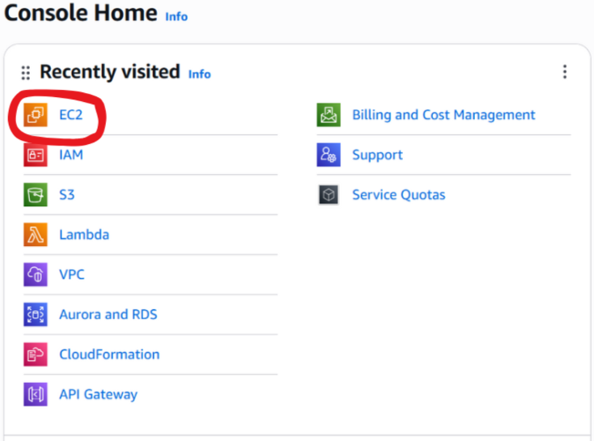
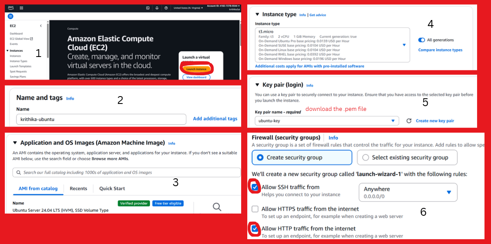
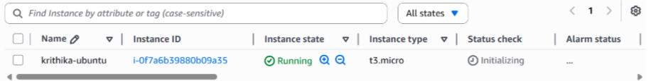
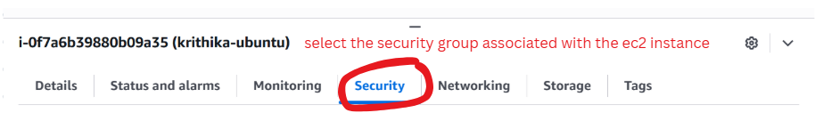
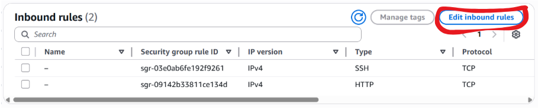
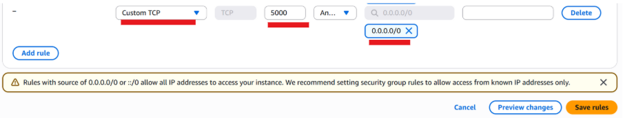
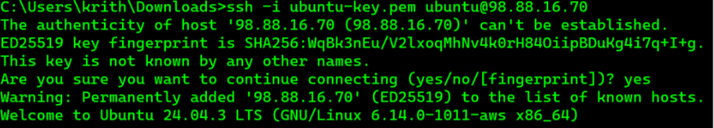
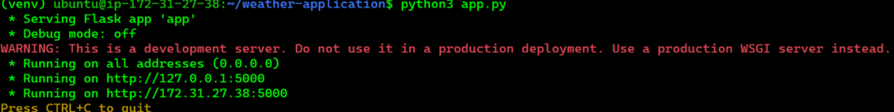
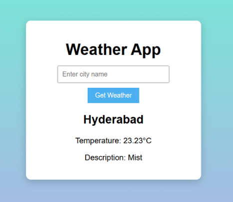
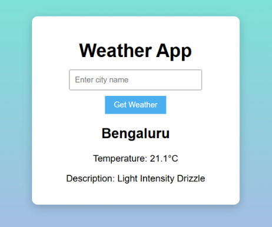

# AWS Lab: Weather-API call

### Objective
Creating a flask weather application in an Ubuntu EC2 instance which can return the temperature and weather of any city. 

## Step 1: Launch an EC2 Ubuntu Instance

1. Log in to the AWS Management Console and open the EC2 Dashboard.
  
   

2. Click "Launch Instance" and configure as shown below:

    

3. Edit the inbound rules in the security group to allow users to access the application we will create.

   <br><br><br>
   <br><br><br>
   <br><br><br>
   

---

## Step 2: Connecting to the instance and install the necessary dependencies

1) Connect to the EC2 instance from your terminal:

```bash
ssh -i your-key.pem ubuntu@<EC2_PUBLIC_IP>
```


2) Run this entire series of commands one by one to install dependencies:

```bash
sudo apt update
```

```bash
sudo apt install python3-pip python3-venv -y
```

```bash
mkdir weather-application
```

```bash
cd weather-application
```

```bash
pip install flask requests
```
---

## Step 3: Create the application

```bash
nano app.py
```
Add the below code into, app.py, replacing with your own API Key (this can be taken from the website - https://home.openweathermap.org/users/sign_in) 

```bash
from flask import Flask, render_template, request
import requests

app = Flask(__name__)

API_KEY = 'your-api-key'
BASE_URL = "http://api.openweathermap.org/data/2.5/weather?"

@app.route("/", methods=["GET", "POST"])
def index():
    weather_data = None

    if request.method == "POST":
        city_name = request.form.get("city")
        complete_url = f"{BASE_URL}q={city_name}&appid={API_KEY}&units=metric"

        try:
            response = requests.get(complete_url)
            response.raise_for_status()
            data = response.json()

            weather_data = {
                "location": data['name'],
                "temperature": data['main']['temp'],
                "description": data['weather'][0]['description'].title()
            }
        except Exception as e:
            weather_data = {"error": str(e)}

    return render_template("index.html", weather=weather_data)

if __name__ == "__main__":
    app.run(host="0.0.0.0", port=5000)
```

```bash
mkdir templates
```

```bash
cd templates
```

```bash
nano index.html
```
Add the below code into index.html: 

```bash
<!DOCTYPE html>
<html>
<head>
    <meta charset="UTF-8">
    <title>Weather App</title>
    <style>
        body {
            font-family: Arial, sans-serif;
            background: linear-gradient(to bottom, #74ebd5, #acb6e5);
            display: flex;
            justify-content: center;
            align-items: center;
            height: 100vh;
        }

        .container {
            background: white;
            padding: 20px 30px;
            border-radius: 10px;
            text-align: center;
            width: 300px;
            box-shadow: 0px 4px 15px rgba(0,0,0,0.2);
        }

        h1 {
            margin-bottom: 15px;
        }

        input {
            padding: 8px;
            width: 70%;
            margin-bottom: 10px;
        }

        button {
            padding: 8px 15px;
            background-color: #4cafef;
            color: white;
            border: none;
            cursor: pointer;
        }

        button:hover {
            background-color: #3790d8;
        }

        .result {
            margin-top: 15px;
        }

        .error {
            color: red;
        }
    </style>
</head>
<body>
    <div class="container">
        <h1>Weather App</h1>
        <form method="POST">
            <input type="text" name="city" placeholder="Enter city name" required>
            <button type="submit">Get Weather</button>
        </form>

        
            
                <p class="error">{{ weather.error }}</p>
            
                <div class="result">
                    <h2>{{ weather.location }}</h2>
                    <p>Temperature: {{ weather.temperature }}°C</p>
                    <p>Description: {{ weather.description }}</p>
                </div>
            
        
    </div>
</body>
</html>
```

---

## Step 4: Running the application

1) Navigate out of the templates directory with "cd ..", and run the below command:

```bash
python3 app.py
```


2) Access the app in your browser with the following URL: 

```bash
http://<your-public-ip>:5000
```

 <br><br><br>



