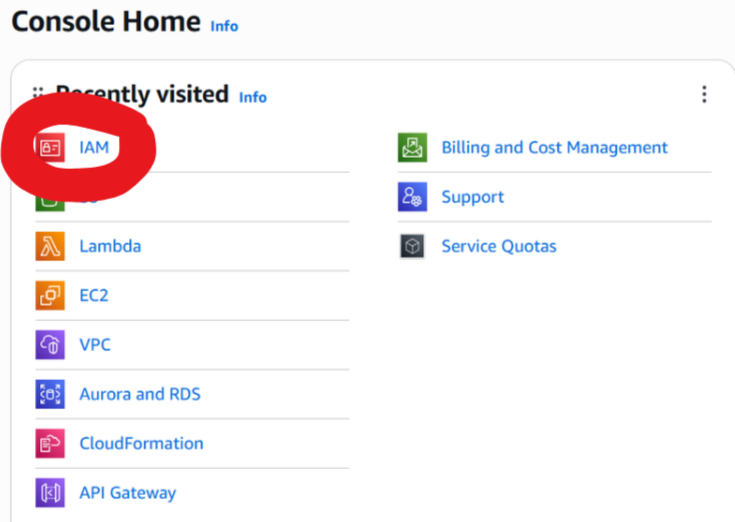

# AWS Lab: Terraform Infrastructure

### Objective
Using terraform code to spin up an S3 bucket and EC2 instance, and terminate them after use.

## Step 1: Configure a new user with necessary permissions

1) Create an IAM user <br><br>
<br>


2) Create access keys for the user:<br>


3) Add the below permissions for the user: <br>


4) Configure AWS credentials: <br>


---

## Step 2: Install Chocolatey on your device

Open Powershell (running as administrator), and paste the below command: 

```bash
Set-ExecutionPolicy Bypass -Scope Process -Force; `
[System.Net.ServicePointManager]::SecurityProtocol = `
[System.Net.ServicePointManager]::SecurityProtocol -bor 3072; `
iex ((New-Object System.Net.WebClient).DownloadString('https://community.chocolatey.org/install.ps1'))
```
---

## Step 3: Open a new tab and install terraform: 

```bash 
choco install terraform -y
```

```bash 
terraform -version
```
---

## Step 4: Preparing the folder structure:

1) Create a folder called "terraform-aws", and add a "main.tf" file inside it.  
2) Paste the below code into "main.tf"
   
```bash
terraform {
  required_providers {
    aws = {
      source  = "hashicorp/aws"
      version = "~> 5.0"
    }
  }
  required_version = ">= 1.5.0"
}

provider "aws" {
  region = "us-east-1"
}

resource "aws_s3_bucket" "my_bucket" {
  bucket = "krithika-terraform-bucket" 
}
```

3) Create a key pair: 

Terraform uses the SSH public key file to create a key pair in AWS. This allows secure login to the EC2 instance without a password.

```bash 
ssh-keygen -t rsa -b 4096
```
<br><br><br>
<br>

---

## Step 5: Creating the s3 Bucket 

Run the following commands

```bash
terraform init
```
<br>


```bash
terraform plan
```
<br>


```bash 
terraform apply
```
<br><br><br>

The bucket is created: <br>
<br>

---

## Step 6: Creating an object inside s3 Bucket

1) Add a .txt file inside your main folder with this command: 

```bash   
echo "Hello from terraform!" > hello.txt
```

2) Add the below code to main.tf

```bash
resource "aws_s3_object" "my_object" {
  bucket = aws_s3_bucket.my_bucket.bucket
  key    = "hello.txt"
  source = "hello.txt"
}
```

3) Apply the changes to add ""hello.txt" as an object inside the s3 bucket.

```bash 
terraform apply
```

The object is created:<br>
<br>

---

## Step 7: Deleting the s3 bucket and object created: 

Comment out the resources in the code as shown below: 

```bash
terraform {
  required_providers {
    aws = {
      source  = "hashicorp/aws"
      version = "~> 5.0"
    }
  }
  required_version = ">= 1.5.0"
}

provider "aws" {
  region = "us-east-1"
}

/*
resource "aws_s3_bucket" "my_bucket" {
  bucket = "krithika-terraform-bucket" 
}

resource "aws_s3_object" "my_object" {
  bucket = aws_s3_bucket.my_bucket.bucket
  key    = "hello.txt"
  source = "hello.txt"
}
*/
```

```bash
terraform apply
```

<br>
---

## Step 8: Adding the VM resource

1) Add the following code to "main.tf" (replace with your public key name)

```bash
resource "aws_key_pair" "terraform-key" {
  key_name   = "terraform-key"
  public_key = file("terraform-key.pub")
}


resource "aws_instance" "my_vm" {
  ami           = "ami-0c7217cdde317cfec" 
  instance_type = "t3.micro"

  key_name      = aws_key_pair.terraform-key.key_name

  tags = {
    Name = "Terraform-VM"
  }
}
```

2) Run the below commands 

```bash
terraform plan
```

```bash
terraform apply
```

The VM and key pairs are created: <br>
<br><br><br>
<br>

---

## Step 9: Delete the VM and the key pair 

```bash 
terraform destroy
```
