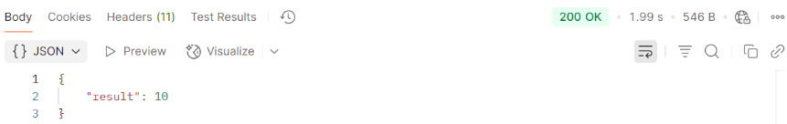

# AWS Lab: Deploying a simple Lambda function using serverless framework
### Objective
Creating and testing an AWS Lambda function (which performs mathematical calculations) using Serverless Framework.
## Step 1: Install node.js and npm (from https://nodejs.org/en)

---

## Step 2: Set up AWS credentials and provide necessary permissions

1. Log in to the AWS Management Console and open the IAM Dashboard.
  
   

2) Create a user and add the administrator access policy:

   <br><br><br>
   <br><br><br>
   <br><br><br>
   


2) Configure with "aws configure"

   

---

## Step 2: Install Serverless Framework by running the below command 

```bash
npm install -g serverless
```

---

## Step 4: Create a serverless project

1) Run the below commands (they will create a project folder called "my-service" with the files - "handler.js", "serverless.yml" and "package.json")

```bash
serverless create --template aws-nodejs --path my-service
```

```bash
cd my-service
```

```bash 
npm init -y
```
2) Replace the code in the serverless.yml file with the following: 

```bash
service: my-service

provider:
  name: aws          
  runtime: nodejs18.x
  region: us-east-1  

functions:
  calculate:
    handler: handler.calculate
    events:
      - http:
          path: calculate
          method: post
```


3) Replace the code in the handler.js file with the following (calculator function code):

```bash
'use strict';

module.exports.calculate = async (event) => {
  try {
    // Parse input JSON
    const body = JSON.parse(event.body || '{}');
    const { operation, numbers } = body;

    if (!operation || !numbers || !Array.isArray(numbers)) {
      return {
        statusCode: 400,
        body: JSON.stringify({ error: 'Please provide "operation" and "numbers" array' }),
      };
    }

    let result;
    switch (operation) {
      case 'add':
        result = numbers.reduce((a, b) => a + b, 0);
        break;
      case 'multiply':
        result = numbers.reduce((a, b) => a * b, 1);
        break;
      default:
        return {
          statusCode: 400,
          body: JSON.stringify({ error: 'Operation must be "add" or "multiply"' }),
        };
    }

    return {
      statusCode: 200,
      body: JSON.stringify({ result }),
    };
  } catch (err) {
    return {
      statusCode: 500,
      body: JSON.stringify({ error: err.message }),
    };
  }
};
```
---

## Step 5: Deploy the project and get the endpoint URL

```bash 
serverless deploy
```


---

## Step 6: Test the function either using the below curl command or Postman

```bash
curl -X POST <url>/dev/calculate \
-H "Content-Type: application/json" \
-d '{"operation":"add","numbers":[5,10,15]}'
```


