# AWS Lab: Magic Box Number Analyzer Using AWS Lambda and S3
### Objective
To design and deploy a fully serverless web application that accepts a user-provided date, derives four numerical inputs, and generates a 4×4 computed “magic box".

## Step 1: Create a Lambda function

1. Log in to the AWS Management Console and open "lambda".
  
   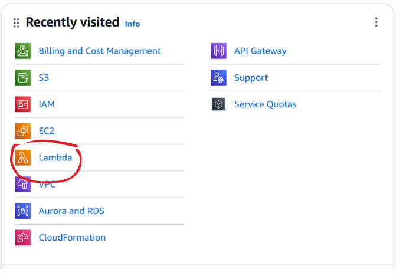

2. Click on "Create Function and configure as shown below"
   
   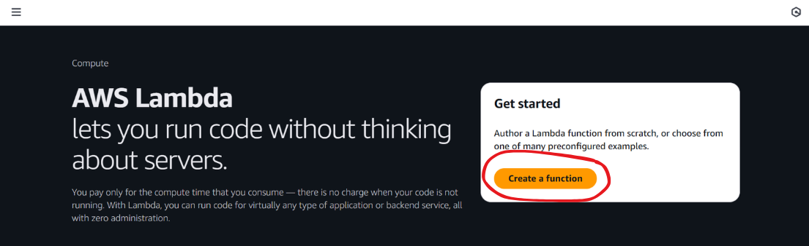<br>
   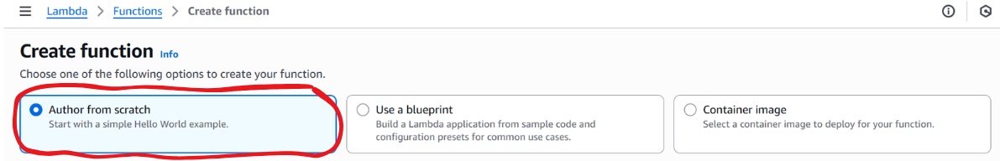<br>
   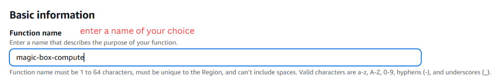<br>
   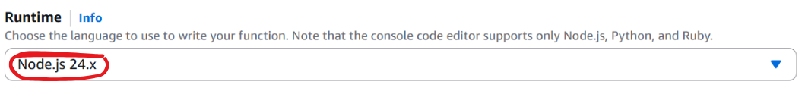<br>
   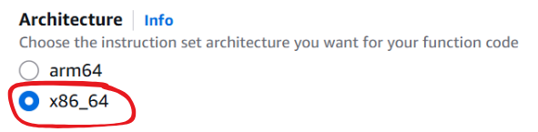<br>
   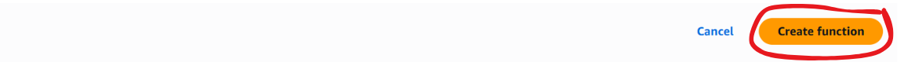<br>

---

## Step 2: Adding the function logic

1.	Inside the Lambda function - add a file called "index.js" and add the following code into it:

```bash
// index.js
// Magic Box Lambda Handler

exports.handler = async (event) => {
  try {
    const body = typeof event.body === "string" ? JSON.parse(event.body) : event.body || event;

    const submittedBy = body.submittedBy || "anonymous";

    // Parse A B C D
    let { A, B, C, D } = body;

    if (A == null || B == null || C == null || D == null) {
      if (!body.date) throw new Error("Provide A,B,C,D or a date string.");

      const tokens = body.date.trim().split(/\s+/);

      if (tokens.length === 4) {
        A = +tokens[0];
        B = +tokens[1];
        C = +tokens[2];
        D = +tokens[3];
      } else if (tokens.length === 3) {
        const dd = +tokens[0];
        const mm = +tokens[1];
        const year = tokens[2];

        A = dd;
        B = mm;

        if (year.length === 4) {
          C = +year.slice(0, 2);
          D = +year.slice(2, 4);
        } else {
          throw new Error("Year must be YYYY when using DD MM YYYY format.");
        }
      } else {
        throw new Error("Invalid date format.");
      }
    }

    // Validate
    [A, B, C, D].forEach(n => {
      if (!Number.isFinite(n)) throw new Error("A,B,C,D must be numbers.");
    });

    // Build 4×4 grid
    const grid = [
      [A, B, C, D],
      [D+1, C-1, B-3, A+3],
      [B-2, A+2, D+2, C-2],
      [C+1, D-1, A+1, B-1]
    ];

    // Row sums
    const rowSums = grid.map(row => row.reduce((a,b)=>a+b,0));

    // Column sums
    const colSums = [0,1,2,3].map(c => grid.reduce((s,r)=>s + r[c], 0));

    // Flatten cells
    const cells = [];
    for (let r=0;r<4;r++){
      for (let c=0;c<4;c++){
        cells.push({ r, c, id:`r${r}c${c}`, val:grid[r][c] });
      }
    }

    // Contiguous combos (rows, cols, 2×2 squares, diagonals)
    const combos = [];

    // rows
    for (let r=0;r<4;r++){
      combos.push({
        type:"row",
        coords:[0,1,2,3].map(c=>`r${r}c${c}`),
        sum: grid[r].reduce((a,b)=>a+b,0)
      });
    }

    // columns
    for (let c=0;c<4;c++){
      combos.push({
        type:"col",
        coords:[0,1,2,3].map(r=>`r${r}c${c}`),
        sum: grid.reduce((s,row)=>s + row[c],0)
      });
    }

    // 2×2 blocks (top-left 3×3 positions)
    for (let r=0;r<3;r++){
      for (let c=0;c<3;c++){
        const ids = [
          `r${r}c${c}`, `r${r}c${c+1}`,
          `r${r+1}c${c}`, `r${r+1}c${c+1}`
        ];
        const sum = ids.reduce((s,id)=>{
          const cell = cells.find(cc=>cc.id===id);
          return s + cell.val;
        },0);

        combos.push({ type:"2x2", coords:ids, sum });
      }
    }

    // diagonals
    combos.push({
      type:"diag",
      coords:[0,1,2,3].map(i=>`r${i}c${i}`),
      sum:[0,1,2,3].reduce((s,i)=>s + grid[i][i],0)
    });
    combos.push({
      type:"diag",
      coords:[0,1,2,3].map(i=>`r${i}c${3-i}`),
      sum:[0,1,2,3].reduce((s,i)=>s + grid[i][3-i],0)
    });

    // All combinations of 4 cells matching any row/column sum
    const targets = new Set([...rowSums, ...colSums]);
    const matches = {};
    for (const t of targets) matches[t] = [];

    const N = cells.length; // 16
    for (let i=0;i<N-3;i++){
      for (let j=i+1;j<N-2;j++){
        for (let k=j+1;k<N-1;k++){
          for (let l=k+1;l<N;l++){
            const ids = [cells[i],cells[j],cells[k],cells[l]];
            const sum = ids.reduce((s,c)=>s + c.val,0);
            if (targets.has(sum)) {
              matches[sum].push({
                coords: ids.map(c=>c.id),
                sum
              });
            }
          }
        }
      }
    }

    const response = {
      submittedBy,
      input:{A,B,C,D},
      grid,
      rowSums,
      colSums,
      contiguousCombos: combos,
      matchedCombos: matches
    };

    return {
      statusCode: 200,
      headers:{
        "Content-Type":"application/json",
        "Access-Control-Allow-Origin":"*"
      },
      body: JSON.stringify(response)
    };

  } catch (err) {
    return {
      statusCode: 400,
      headers:{
        "Access-Control-Allow-Origin":"*"
      },
      body: JSON.stringify({ error: err.message || String(err) })
    };
  }
};
```
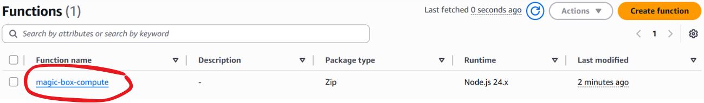<br>
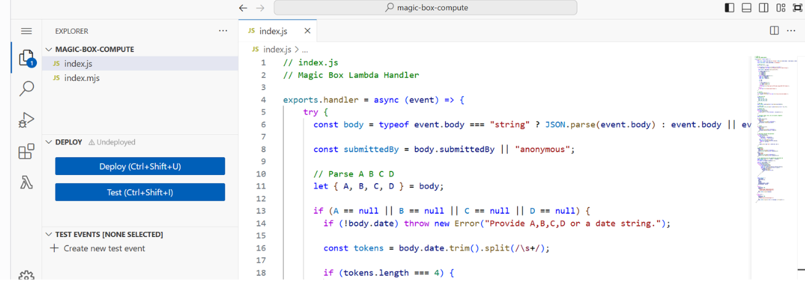

---

## Step 3: Deploy the function 

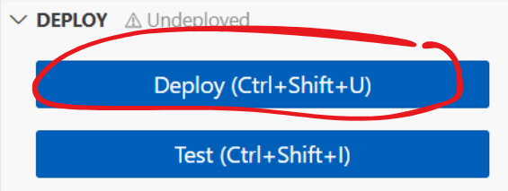

Go to the "Runtime Settings" section and make sure that the handler is set to "index.handler"

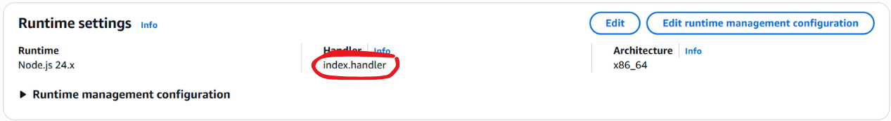

---

## Step 4: Create the API Gateway endpoint

1.	Open the AWS console and click on "API Gateway". 

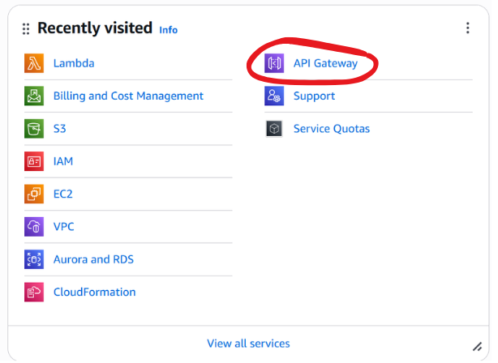

2. Build a HTTP API.

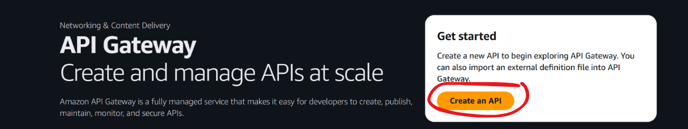<br>
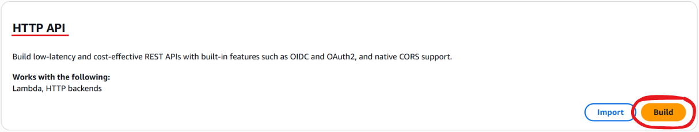

3. Configure as per the steps shown below: 
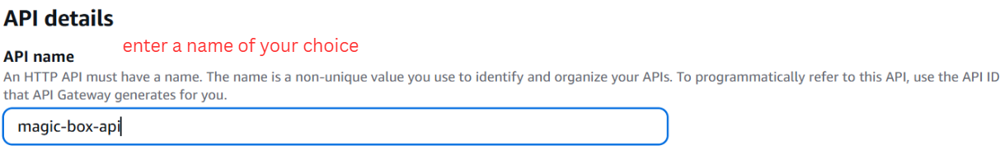<br>
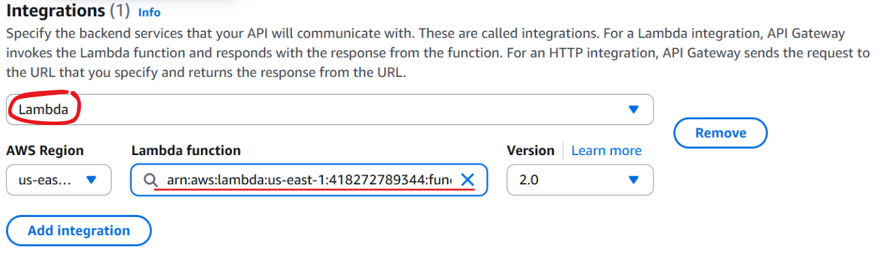<br>
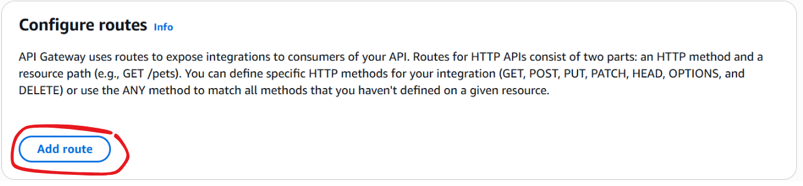<br>
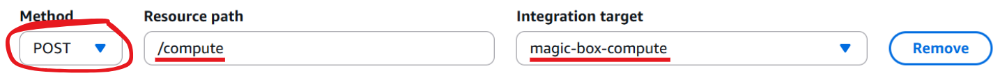<br>


Leave the other permissions at default.

---

## Step 5: Create the API Gateway and copy the invoke URL (can be found in "stages")

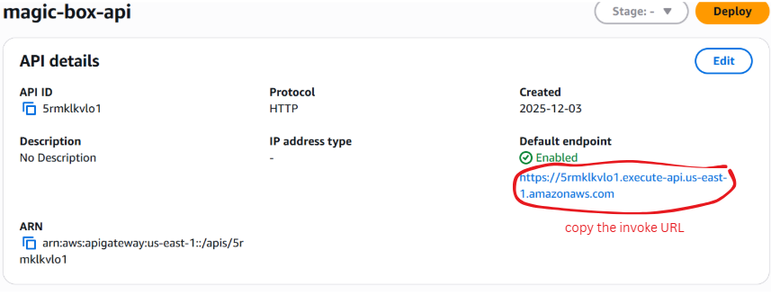

---

## Step 6: Create a project structure as given below:

```bash
magic-box-app/
│
├── lambda/
│   ├── index.js  
│   └── package.json  
│
└── frontend/
├── index.html  
├── app.js  
└── style.css
```

1.	Enter the following code in index.js: 

```bash
// index.js
// Magic Box Lambda Handler

exports.handler = async (event) => {
  try {
    const body = typeof event.body === "string" ? JSON.parse(event.body) : event.body || event;

    const submittedBy = body.submittedBy || "anonymous";

    // Parse A B C D
    let { A, B, C, D } = body;

    if (A == null || B == null || C == null || D == null) {
      if (!body.date) throw new Error("Provide A,B,C,D or a date string.");

      const tokens = body.date.trim().split(/\s+/);

      if (tokens.length === 4) {
        A = +tokens[0];
        B = +tokens[1];
        C = +tokens[2];
        D = +tokens[3];
      } else if (tokens.length === 3) {
        const dd = +tokens[0];
        const mm = +tokens[1];
        const year = tokens[2];

        A = dd;
        B = mm;

        if (year.length === 4) {
          C = +year.slice(0, 2);
          D = +year.slice(2, 4);
        } else {
          throw new Error("Year must be YYYY when using DD MM YYYY format.");
        }
      } else {
        throw new Error("Invalid date format.");
      }
    }

    // Validate
    [A, B, C, D].forEach(n => {
      if (!Number.isFinite(n)) throw new Error("A,B,C,D must be numbers.");
    });

    // Build 4×4 grid
    const grid = [
      [A, B, C, D],
      [D+1, C-1, B-3, A+3],
      [B-2, A+2, D+2, C-2],
      [C+1, D-1, A+1, B-1]
    ];

    // Row sums
    const rowSums = grid.map(row => row.reduce((a,b)=>a+b,0));

    // Column sums
    const colSums = [0,1,2,3].map(c => grid.reduce((s,r)=>s + r[c], 0));

    // Flatten cells
    const cells = [];
    for (let r=0;r<4;r++){
      for (let c=0;c<4;c++){
        cells.push({ r, c, id:`r${r}c${c}`, val:grid[r][c] });
      }
    }

    // Contiguous combos (rows, cols, 2×2 squares, diagonals)
    const combos = [];

    // rows
    for (let r=0;r<4;r++){
      combos.push({
        type:"row",
        coords:[0,1,2,3].map(c=>`r${r}c${c}`),
        sum: grid[r].reduce((a,b)=>a+b,0)
      });
    }

    // columns
    for (let c=0;c<4;c++){
      combos.push({
        type:"col",
        coords:[0,1,2,3].map(r=>`r${r}c${c}`),
        sum: grid.reduce((s,row)=>s + row[c],0)
      });
    }

    // 2×2 blocks (top-left 3×3 positions)
    for (let r=0;r<3;r++){
      for (let c=0;c<3;c++){
        const ids = [
          `r${r}c${c}`, `r${r}c${c+1}`,
          `r${r+1}c${c}`, `r${r+1}c${c+1}`
        ];
        const sum = ids.reduce((s,id)=>{
          const cell = cells.find(cc=>cc.id===id);
          return s + cell.val;
        },0);

        combos.push({ type:"2x2", coords:ids, sum });
      }
    }

    // diagonals
    combos.push({
      type:"diag",
      coords:[0,1,2,3].map(i=>`r${i}c${i}`),
      sum:[0,1,2,3].reduce((s,i)=>s + grid[i][i],0)
    });
    combos.push({
      type:"diag",
      coords:[0,1,2,3].map(i=>`r${i}c${3-i}`),
      sum:[0,1,2,3].reduce((s,i)=>s + grid[i][3-i],0)
    });

    // All combinations of 4 cells matching any row/column sum
    const targets = new Set([...rowSums, ...colSums]);
    const matches = {};
    for (const t of targets) matches[t] = [];

    const N = cells.length; // 16
    for (let i=0;i<N-3;i++){
      for (let j=i+1;j<N-2;j++){
        for (let k=j+1;k<N-1;k++){
          for (let l=k+1;l<N;l++){
            const ids = [cells[i],cells[j],cells[k],cells[l]];
            const sum = ids.reduce((s,c)=>s + c.val,0);
            if (targets.has(sum)) {
              matches[sum].push({
                coords: ids.map(c=>c.id),
                sum
              });
            }
          }
        }
      }
    }

    const response = {
      submittedBy,
      input:{A,B,C,D},
      grid,
      rowSums,
      colSums,
      contiguousCombos: combos,
      matchedCombos: matches
    };

    return {
      statusCode: 200,
      headers:{
        "Content-Type":"application/json",
        "Access-Control-Allow-Origin":"*"
      },
      body: JSON.stringify(response)
    };

  } catch (err) {
    return {
      statusCode: 400,
      headers:{
        "Access-Control-Allow-Origin":"*"
      },
      body: JSON.stringify({ error: err.message || String(err) })
    };
  }
};
```

2. Enter the following code into package.json:

```bash
{
  "name": "magic-box-lambda",
  "version": "1.0.0",
  "main": "index.js",
  "description": "Magic box calculation Lambda",
  "license": "MIT"
}
```

3. Enter the following code into index.html:

```bash
<!doctype html>
<html>
<head>
  <meta charset="utf-8">
  <title>Magic Box App</title>
  <link rel="stylesheet" href="style.css">
</head>
<body>

<h2>Magic 4×4 Box</h2>

<div class="controls">
  <input id="date" placeholder="31 12 1995 or 31 12 19 95">
  <input id="name" placeholder="Your name">
  <button id="go">Compute</button>
  <span id="status"></span>
</div>

<div id="grid" class="grid"></div>

<div class="sum-section">
  <div>
    <h4>Row sums</h4>
    <div id="rows"></div>
  </div>

  <div>
    <h4>Column sums</h4>
    <div id="cols"></div>
  </div>
</div>

<h3>Combinations</h3>
<div id="combos"></div>

<script src="app.js"></script>
</body>
</html>
```

4. Enter the following code into style.css: 

```bash
body {
  font-family: system-ui, sans-serif;
  margin: 20px;
}

.controls {
  display: flex;
  gap: 10px;
  align-items: center;
  margin-bottom: 15px;
}

#status.ok { color: green; }
#status.err { color: red; }

.grid {
  display: grid;
  grid-template-columns: repeat(4, 60px);
  gap: 8px;
  margin: 15px 0;
}

.cell {
  width: 60px;
  height: 60px;
  background: #f5f5f5;
  border: 1px solid #bbb;
  border-radius: 6px;
  display: flex;
  align-items: center;
  justify-content: center;
  font-weight: bold;
}

.cell.highlight {
  background: #ffe9b5;
  border-color: #ffb64c;
}

.sum-section {
  display: flex;
  gap: 40px;
}

#combos .item {
  padding: 6px;
  border-bottom: 1px solid #ddd;
  cursor: pointer;
}
```

5. Enter the following code into app.js, and replace the API URL (on the first line) with the URL that you have copied in step 5:

```bash
const API = "YOUR_API_URL"; 

const gridDiv = document.getElementById("grid");
const rowsDiv = document.getElementById("rows");
const colsDiv = document.getElementById("cols");
const combosDiv = document.getElementById("combos");
const statusSpan = document.getElementById("status");

document.getElementById("go").onclick = async () => {
  const date = document.getElementById("date").value.trim();
  const name = document.getElementById("name").value.trim() || "anonymous";

  statusSpan.textContent = "Working...";
  statusSpan.className = "";

  try {
    const res = await fetch(API, {
      method:"POST",
      headers:{ "Content-Type":"application/json" },
      body: JSON.stringify({ date, submittedBy:name })
    });

    if (!res.ok) throw new Error(await res.text());

    const data = await res.json();
    renderGrid(data.grid);
    renderSums(data.rowSums, data.colSums);
    renderCombos(data);

    statusSpan.textContent = "Done";
    statusSpan.className = "ok";

  } catch (err) {
    statusSpan.textContent = "Error: " + err.message;
    statusSpan.className = "err";
  }
};

function renderGrid(grid) {
  gridDiv.innerHTML = "";
  for (let r=0;r<4;r++){
    for (let c=0;c<4;c++){
      const cell = document.createElement("div");
      cell.className = "cell";
      cell.id = `r${r}c${c}`;
      cell.textContent = grid[r][c];
      gridDiv.appendChild(cell);
    }
  }
}

function highlight(ids) {
  document.querySelectorAll(".cell").forEach(el => el.classList.remove("highlight"));
  ids.forEach(id => {
    const el = document.getElementById(id);
    if (el) el.classList.add("highlight");
  });
}

function renderSums(rowSums, colSums) {
  rowsDiv.innerHTML = rowSums.map((s,i)=>`Row ${i+1}: ${s}`).join("<br>");
  colsDiv.innerHTML = colSums.map((s,i)=>`Col ${i+1}: ${s}`).join("<br>");
}

function renderCombos(data) {
  combosDiv.innerHTML = "";

  // Contiguous combos first
  data.contiguousCombos.forEach(c => {
    const div = document.createElement("div");
    div.className = "item";
    div.innerHTML = `<b>${c.type}</b> sum=${c.sum} — ${c.coords.join(", ")}`;
    div.onclick = () => highlight(c.coords);
    combosDiv.appendChild(div);
  });

  // All matching combos
  for (const sum in data.matchedCombos) {
    const arr = data.matchedCombos[sum];
    if (!arr.length) continue;

    const head = document.createElement("div");
    head.className = "item";
    head.style.background = "#eee";
    head.textContent = `All 4-cell combos with sum ${sum} (${arr.length})`;
    combosDiv.appendChild(head);

    arr.forEach(m => {
      const d = document.createElement("div");
      d.className = "item";
      d.textContent = `${m.coords.join(", ")} = ${m.sum}`;
      d.onclick = () => highlight(m.coords);
      combosDiv.appendChild(d);
    });
  }
}
```
---

## Step 6: Enable CORS

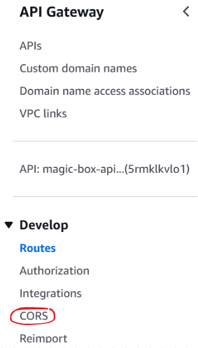 <br>

Configure as shown below and save it. 

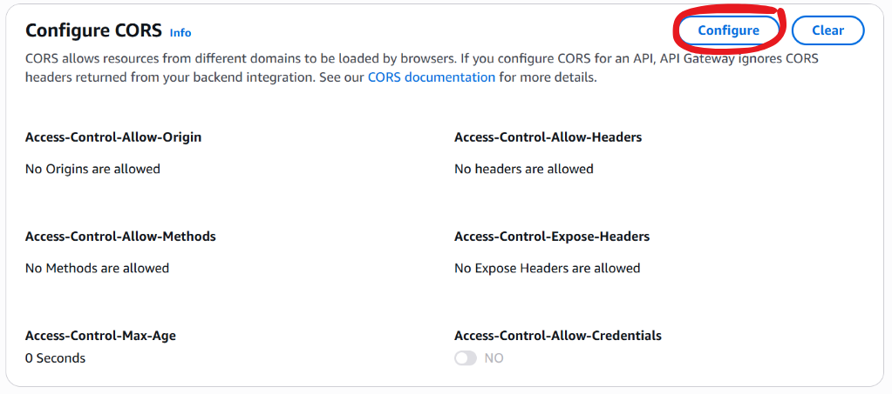<br>
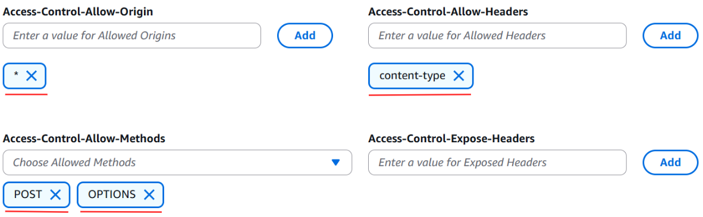 

---

## Step 7: Upload the Frontend in the S3 buckets

1.	Create an S3 bucket

<br>
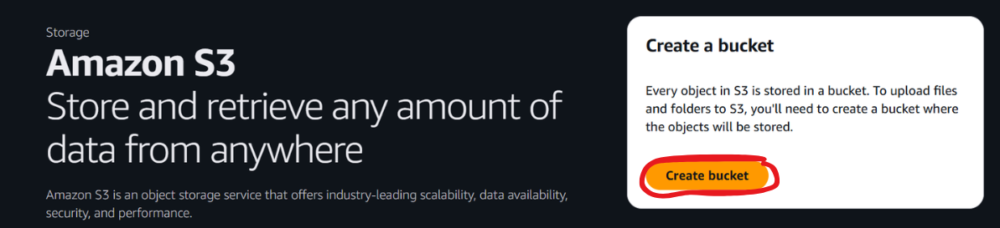<br>
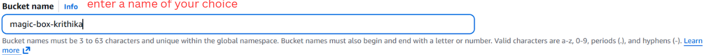<br>
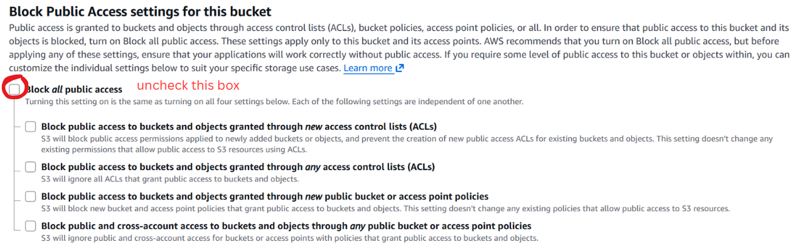<br>
<br>
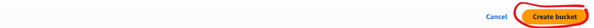

2. Enable Static Website hosting

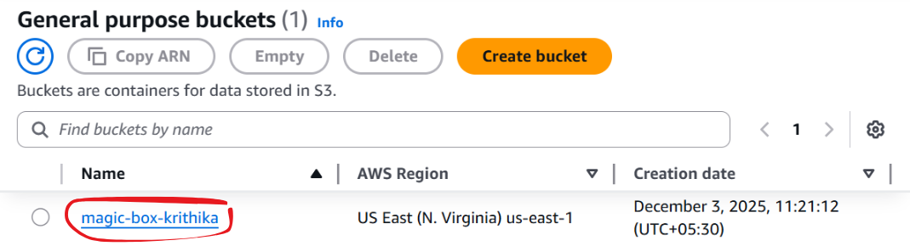<br>
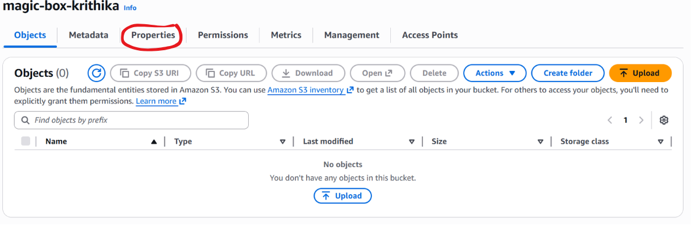<br>
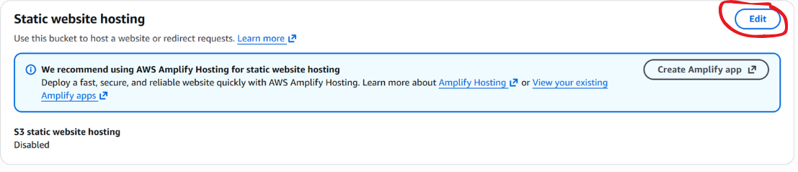<br>
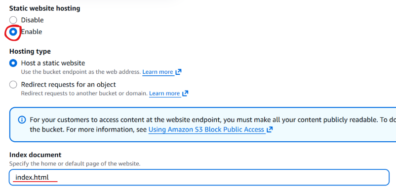

3. Upload the frontend files into the object tab: 

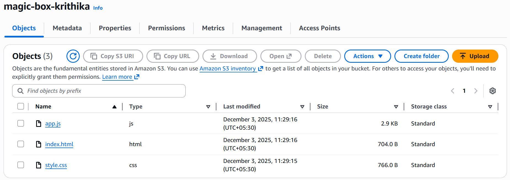<br>

4. Go to the permissions tab and add the bucket policy given below: 

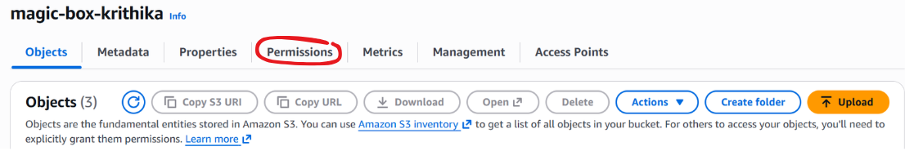<br>
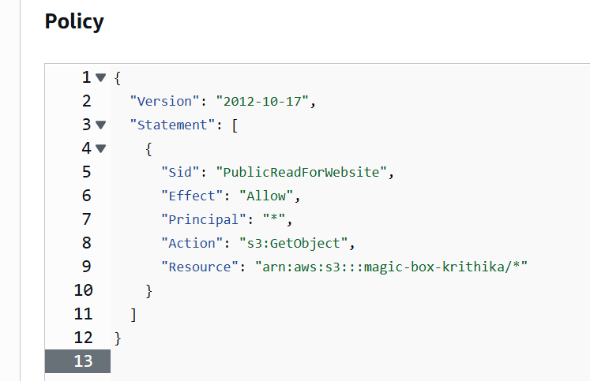

Bucket policy (replace with your own bucket name in the last line:)
```bash 
{
  "Version": "2012-10-17",
  "Statement": [
    {
      "Sid": "PublicReadForWebsite",
      "Effect": "Allow",
      "Principal": "*",
      "Action": "s3:GetObject",
      "Resource": "arn:aws:s3:::YOUR-BUCKET-NAME/*"
    }
  ]
}
```
5. Find your endpoint URL, which is usually in the below given format, to enter your website and test the magic box. 

```bash 
http://your-bucket-name.s3-website-region.amazonaws.com
```

