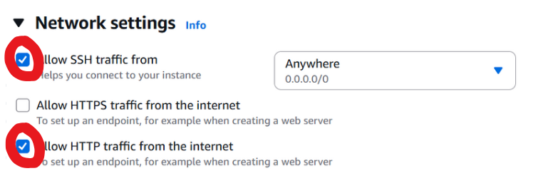
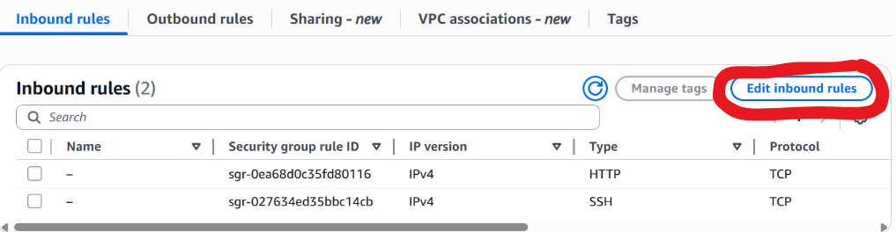

# AWS Lab: Deploying a Flask Application on Amazon Linux EC2

### Objective
Creating an Amazon Linux EC2 instance, connecting to it using SSH, and creating a simple Flask web application.
## Step 1: Launch an EC2 Instance

1. Log in to the AWS Management Console and open the EC2 Dashboard.
  
   


2. Click "Launch Instance" and configure as follows:

   

   

   

   

   

   

   

   

---

## Step 2: Set Key File Permissions

AWS requires your private key file (`.pem`) to have restricted permissions before connecting to your instance.  

**Windows (PowerShell):**
```powershell
icacls "C:\Users\<YourName>\.ssh\your-key.pem" /inheritance:r
icacls "C:\Users\<YourName>\.ssh\your-key.pem" /grant:r "$($env:USERNAME):(R)" 
```

Linux/macOS:

```bash
chmod 400 ~/.ssh/your-key.pem
```

---

## Step 3: Connect to the Instance

Use SSH to connect to your EC2 instance.

   

   

   

---

## Step 4: Update and Install Packages

```bash
sudo dnf update -y
sudo dnf install python3-pip -y
pip3 install flask
```

---


## Step 5: Set Up the Flask App

1. Create a project directory:

```bash
mkdir flask-app
cd flask-app
```


2. Create a Python file:

```bash
nano app.py
```

3. Paste this code:

```python
from flask import Flask

app = Flask(__name__)

@app.route('/')
def home():
    return """
    <html>
        <head>
            <title>Flask on EC2</title>
            <style>
                body {
                    background: linear-gradient(135deg, #4b6cb7, #182848);
                    color: #fff;
                    font-family: 'Segoe UI', sans-serif;
                    display: flex;
                    flex-direction: column;
                    justify-content: center;
                    align-items: center;
                    height: 100vh;
                    margin: 0;
                }
                h1 {
                    font-size: 3em;
                    margin-bottom: 0.3em;
                    text-shadow: 2px 2px 5px rgba(0,0,0,0.3);
                }
                p {
                    font-size: 1.3em;
                    color: #e0e0e0;
                }
                .button {
                    background-color: #ff6f61;
                    color: white;
                    padding: 10px 20px;
                    border: none;
                    border-radius: 10px;
                    margin-top: 20px;
                    cursor: pointer;
                    transition: background 0.3s;
                }
                .button:hover {
                    background-color: #ff3b2e;
                }
            </style>
        </head>
        <body>
            <h1>Welcome to Your EC2 Flask App!</h1>
            <p>This page is running live on Amazon EC2.</p>
            <button class="button" onclick="alert('Your Flask app says hi!')">Click Me</button>
        </body>
    </html>
    """

if __name__ == '__main__':
    app.run(host='0.0.0.0', port=5000)
```

---

## Step 6: Open Port 5000 in Security Group

     

     

     

     

---

## Step 7: Run the Application

```bash
python3 app.py
```

    

---

## Step 8: Access the App

Copy your instance’s Public DNS.

    

---

## Step 9: Open it in your browser:

http://<your-public-dns>:5000

    

