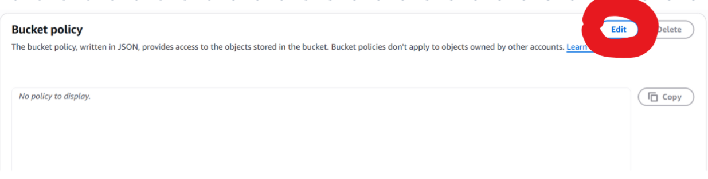

# AWS Lab: Hosting a Static Website on an S3 bucket

### Objective
Creating an S3 bucket, uploading objects into it, and configuring it for static website hosting.

## Step 1: Creating an S3 bucket

1. Log in to the AWS Management Console and open the S3 Dashboard.

     

2. Click "Create bucket" and configure as follows:

     <br><br><br>
     <br><br><br>
     <br><br><br>
     
---

## Step 2: Enable Static Website Hosting

1. Open the bucket 

     

2. Enable hosting 

     <br><br><br>
     <br><br><br>
     <br><br><br>
     <br><br><br>
     

---

## Step 3: Adding the Objects to the Bucket

1. Create the necessary files needed for the website. Here is a template for HTML and CSS codes as an example. 

```html
   <!DOCTYPE html>
   <html lang="en">
   <head>
      <meta charset="UTF-8" />
      <meta name="viewport" content="width=device-width, initial-scale=1.0" />
      <title>My Static Site</title>
      <link rel="stylesheet" href="style.css" />
   </head>
   <body>
      <div class="container">
         <h1>Hello, World!</h1>
         <p>This site is running from an S3 bucket.</p>
         
      </div>
   </body>
   </html>
```
```css   
   body {
    font-family: 'Segoe UI', Tahoma, sans-serif;
    background: #A627F5;
    margin: 0;
    padding: 0;
    color: white;
   }

  .container {
    text-align: center;
    margin-top: 10%;
   }

   h1 {
    font-size: 3rem;
    color: white;
   }

   p {
    font-size: 1.2rem;
   }

   img {
    margin-top: 2rem;
    max-width: 400px;
    border-radius: 10px;
    box-shadow: 0 4px 12px rgba(0,0,0,0.2);
   }
```
2) Upload all the necessary files into the s3 bucket: 

     <br><br><br>
     


---

## Step 4: Making the files public

<br><br><br>


Paste the below policy (and replace with your bucket name on the last line)

```bash
{
  "Version": "2012-10-17",
  "Statement": [
    {
      "Sid": "PublicReadGetObject",
      "Effect": "Allow",
      "Principal": "*",
      "Action": "s3:GetObject",
      "Resource": "arn:aws:s3:::krithika-static-website/*"
    }
  ]
}
```
---

## Step 5: Access the Website

You can visit the website on the browser using the endpoint URL that you had copied earlier (in step 2). 


